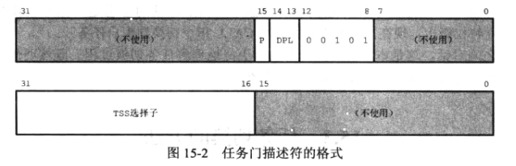
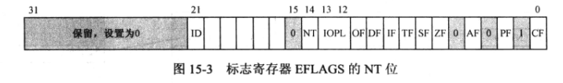
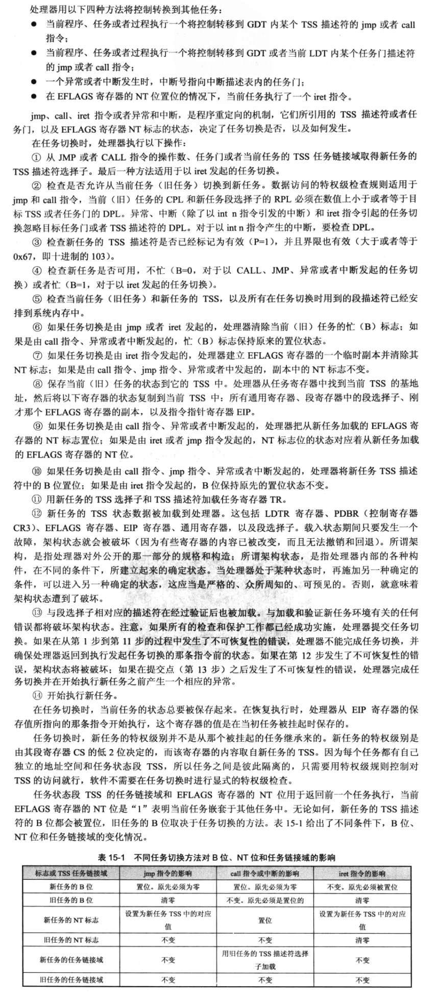

# 任务切换
### 任务门

* TSS选择子
* P位：该门是否有效
* DPL：任务门描述符的特权级，但是对因中断发起的任务切换不起作用，处理器不按特权级施加任何保护。

### 任务门中断
1. `中断号*8` 访问中断描述符表，如果是任务门描述符，就发起任务切换
2. 取出任务门描述符，读取其中的TSS选择子
3. 从GDT中取出新任务的TSS描述符
4. 保存当前任务的状态到TR指向的TSS描述符
5. 访问新任务的TSS，从中恢复各寄存器的状态
6. TR指向新任务的TSS，当新任务开始执行，TSS描述符中的B位置1，表示任务在忙

### iret返回
如果是常规中断就返回被中断的任务，如果是任务切换就返回到旧任务

> **iret怎么区分任务切换和常规中断？**
> 
>  EFLAGS有个NT位（嵌套任务标志），如果为1，表示当前任务嵌套在其他任务中，且TSS中的任务链接域指向前一个任务。
> 
> 中断时会将新任务的NT位置1，且TSS的任务链接域指向旧任务。旧任务的NT和B都不变。
> iret时会判断NT域，如果是1就返回到旧任务，且把当前任务EFLAGS的NT位置0，B位置0（非忙）。

### CALL和JMP的任务切换
* `call 选择子:偏移量`或`jmp  选择子:偏移量`：通过选择子访问GDT或LDT。如果是代码段描述符，就正常跳转；如果是调用门，则按调用门规则执行；如果是任务门，则任务切换，那么偏移量也没用了。
* call类似于任务门中断，会产生任务嵌套。旧任务B位不变，NT位不变。新任务B位置1，NT位置1，TSS的任务链接域指向旧任务。
* jmp没有嵌套关系。旧任务B位置0，NT位不变。新任务B位置1，NT位不变。

### 任务不可重入
任务切换时（iret，中断，CALL，JMP），新任务不可为忙（B位为1）。
* 任务切换，新任务不能为自己。
* 不能call嵌套任务

### iret和iretd
实际上，这是同一条指令
```asm
[bits 16]
iret      ;编译后机器码为CF
iretd     ;编译后机器码为66 CF，因为要按32位执行，须加指令前缀66

[bits 32]
iret      ;编译后机器码为CF
iretd     ;编译后机器码为CF，两个一样
```

### 处理器在实际任务切换时的操作


