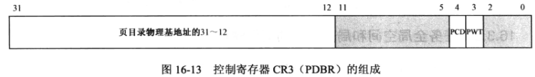
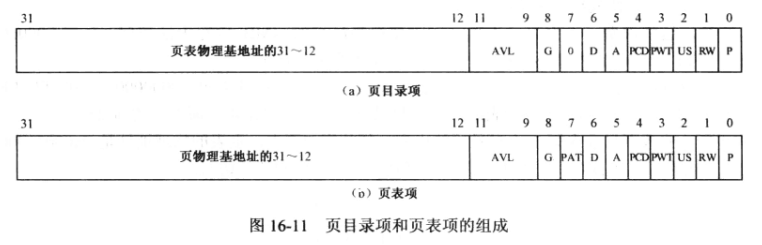
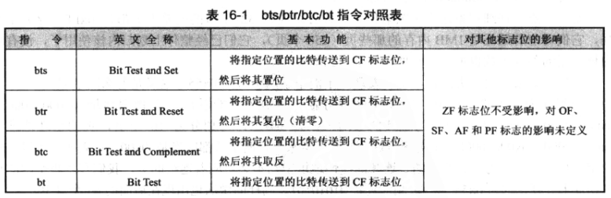

## 页表管理
### 控制寄存器CR3
存放当前任务页目录的物理地址。又叫做页目录基址寄存器（PDBR）

* **PWT页级通写位** 
* **PCD页级高速缓存禁止位** 
* **页目录物理基地址31~12**
### 控制寄存器CR0
* **PE位（0位）开启保护模式**
* **PG位（31位）开启页功能** 只有先开启保护模式才能开启页功能
### 页目录项和页表项
每个任务都有独立的页表。

* **P存在位** 1：存在内存中。
* **RW读写位** 1：可读可写。0：只可读。
* **US用户/管理员位** 1：所有程序都能访问。0：3特权级别的无法访问。
* **PWT页级通写位** 
> 通写：处理器高速缓存的一种工作方式
* **PCD页级高速缓存禁止位** 间接决定该表项所指向的页是否使用高速缓存策略。
* **A访问位** 由处理器固件设置，指示该页是否被访问过。
* **D脏位** 由处理器固件设置，指示该页是否写过数据。
* **PAT页属性表支持位** 和页高速缓存有关。
* **G全局位** 当页是全局的时，它将在高速缓存中一直保存。当因任务切换等原因改变CR3寄存器内容时，整个页高速缓存的内容都会刷新。（不只是全局页，所有高速缓存页都会刷新）
* **AVL位** 被处理器忽略，软件可以使用。
* **物理基地址31~12**
### 页映射位串
每个页对应一个比特或字节，表示页是否被分配。
### bts指令 
bts 页映射位串的地址, 要比较的页在页映射位串中的偏移
将那个页对应的位存到EFLAGS寄存器的CF位，并将原处的比特位置位（置1）。

## 页表实现
### 内核的页表
* 线性地址等于物理地址
* 在用户空间的虚拟地址的高位

